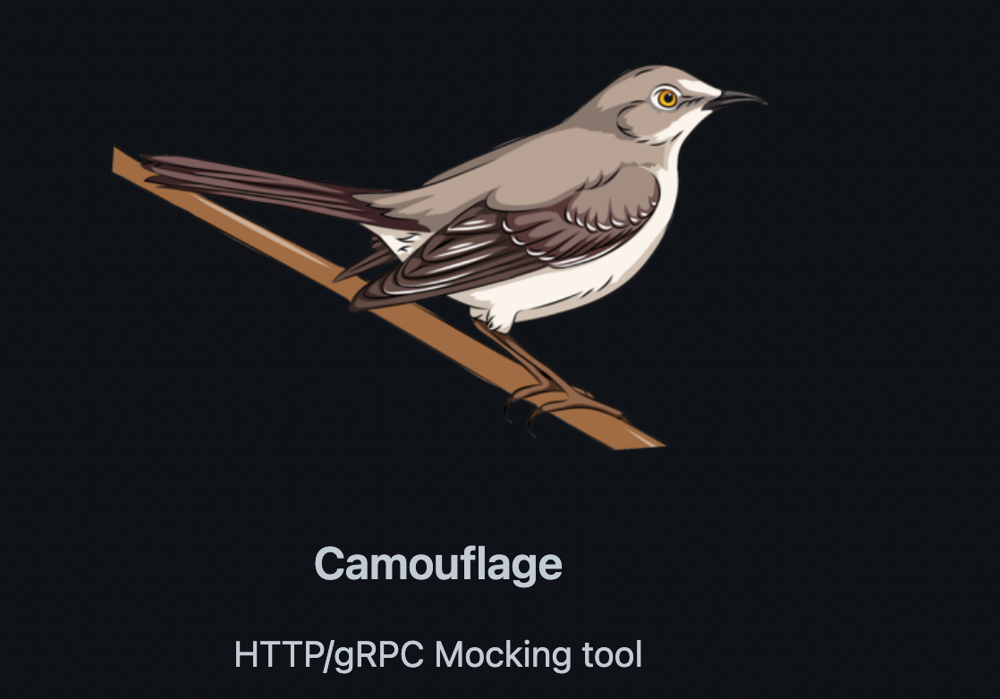
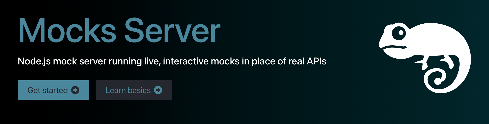

# **Mock Server (Camouflage) POC**

## Low Level Requirements

1. Must utilise Typescript

2. Must demonstrate the use and benefit after with a pros and cons

3. Must represent some **public API** (define here as working concept) that may be easy to replicate so tests can compare with what has been generated

   2.1. https://petstore3.swagger.io/ is a good example covering a big range of things from an open text point of view

   2.2. https://gorest.co.in/ is a good example of many different API's without swagger that can be sampled for the purpose of trying to manualy setup an endpoint

### Camouflage understanding

​	TODO:

# Mocks Server POC

Setup a POC for  https://www.mocks-server.org/ and get an [overview](https://www.mocks-server.org/docs/overview/) of how this all works. Setup the [installation](https://www.mocks-server.org/docs/installation/) and a base typescript project. Follow the [quick start](https://www.mocks-server.org/docs/quick-start/) to get this up and running quickly.

## Low level requirements

1. Must utilise **Typescript** - https://www.mocks-server.org/docs/guides/using-babel/
2. Must represent some **public API** (define here as working concept) that may be easy to replicate so tests can compare with what has been generated

   2.1. https://petstore3.swagger.io/ is a good example covering a big range of things from an open text point of view

   2.2. https://gorest.co.in/ is a good example of many different API's without swagger that can be sampled for the purpose of trying to manualy setup an endpoint
3. Must be tested with inputs and outputs and several **variants** of what can happen with that endpoint
4. Must be able to **demonstrate** the use of this to other developers to understand the benefit

### Mocks Server understanding

1. Has a **Cypress Integration** that will make this a doddle to test https://www.mocks-server.org/docs/integrations/cypress/ visually and simply making changes quick and easy
2. Allows configuration of **middleware** to allow logic to be assigned to endpoints https://www.mocks-server.org/docs/usage/variants/middleware/
3. Can configure with **Open API** https://www.mocks-server.org/docs/integrations/openapi/
4. Very easy to setup with **Docker** https://www.mocks-server.org/docs/integrations/docker/
5. Configure **HTTPS** https://www.mocks-server.org/docs/guides/https-protocol/
6. Enable **CORS** with https://www.mocks-server.org/docs/guides/using-the-options-method/

### POC

## Durability options

Persistence or configuration of data can be done ephemerally using MongoDb in memory using https://github.com/nodkz/mongodb-memory-server with the advantage that no devops resources needs to be setup and seeding of data can be done within some seeding method to make this generic, solving durability in a lightway solution. This is an ephemeral solution, but because we have a seeding mechanism, this can always be reset to determinable state, making API's more useful.
